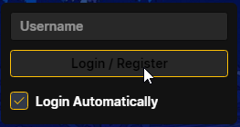

# Single Player Tarkov (SPT)
Acronym for Single Player Tarkov, it is a mod that allows you to play Escape From Tarkov by yourself, without connecting to the BSG infrastructure. Mod support is enabled by default and is highly encouraged by the community.

Consult the official [SPT Website](https://hub.sp-tarkov.com/) for more details and mod selections.

## Vanilla Installation
**Updated 2024-04-28**

1. Install Escape from Tarkov normally and update it to its latest version.
2. Download the latest release of this modpack and unzip it.
3. Download the latest version of [SPT-AKI Installer](https://hub.sp-tarkov.com/)
4. Create an new empty folder named `spt`, `spt380`, `penis` or whatever.
5. Copy `SPTInstaller.exe` into this new folder and run it. Follow the instructions to install.
6. Once installed, run the `Aki.Server.exe` (and whitelist it from your anti-virus if needed). It will create the bare minimum folders to the rest of the steps.
7. Once you have the `Server is running, do not close while playing SPT` message, leave it open and run the `Aki.Launcher.exe`

> 

8. Create an 'account' by adding an username & 'login in'. This will be your `spt profile`. You can choose which edition to start with (I personally recommend to starters to use the `Edge of Darkness Edition` or for veteran the `SPT Zero To Hero`)

> 
> 

9. Start the game via the launcher, create your Escape From Tarkov character (Faction, Name, Character face & voice).

You are good to go!

## Modded Installation (Recommended mods by Beltaine)
1. Close any running SPT AKI server & launcher.
2. Extract the contents of the `mods folder` and copy them into your `SPT` installation folder.
3. Relaunch the server and then the launcher!
4. Some of the mods will require a restart of your SPT profile.

### SAIN, SWAG, Donuts
Included in the mods are Sain, SWAG+Donuts which are bots altering behavior and spawns overhaul mods. The default values might be overtuned for your first time. I would recommended tuning them down via the following in the game:

1. Press F6 to open SAIN menu
2. Select the `Less Difficult for SAIN 2.1.12` option.

> 

3. Save at the top right corner of the screen.

1. Press F12 to open the BepInEx settings.
2. Open the `dvise.Donuts 1.4.3` option and change the `PMC Raid Preset Selection` to `Starting PMCs Only (Random)`.

> 

### Server Value Modifier
Included in the mods is Server Value Modifier. This allows you to customize your SPT server as you wish (change reload speed, PMC health, loot modifiers, etc).

1. Once you have run the `AKI.Server` & `AKI.Launcher` with a proper profile, close both of them before continuing (this creates missing files from installation).
2. Go to your SPT installation folder, reach out `user/mods/ServerValueModifier` and run the `Greed.exe`.
3. This will open the application; it will allow you to modify any values of your server (make sure the tab `Power Icon` is green to activate the changes).

4. Save your Presets and apply the changes!

# Multi Player Tarkov (MPT, Requires [SPT](#SPT))
MPT is a co-op, multiplayer mod for Single Player Tarkov that allows players to play via TCP/UDP (P2P) together. 

## [Installation](https://github.com/project-fika/fika-documentation?tab=readme-ov-file#client-using-port-forwarding)
1. Copy the content of the `MPT` folder into your `SPT` installation folder.
2. Start `Aki.Launcher.exe` of your `SPT` installation folder and click on `Settings` (top right).
3. In the `URL` field, change it to reflect the hosts WAN IP (remember to remove any trailing forward slashes /).
4. If hosting in-game, allow all connections (public and private) when prompted by the Windows Firewall